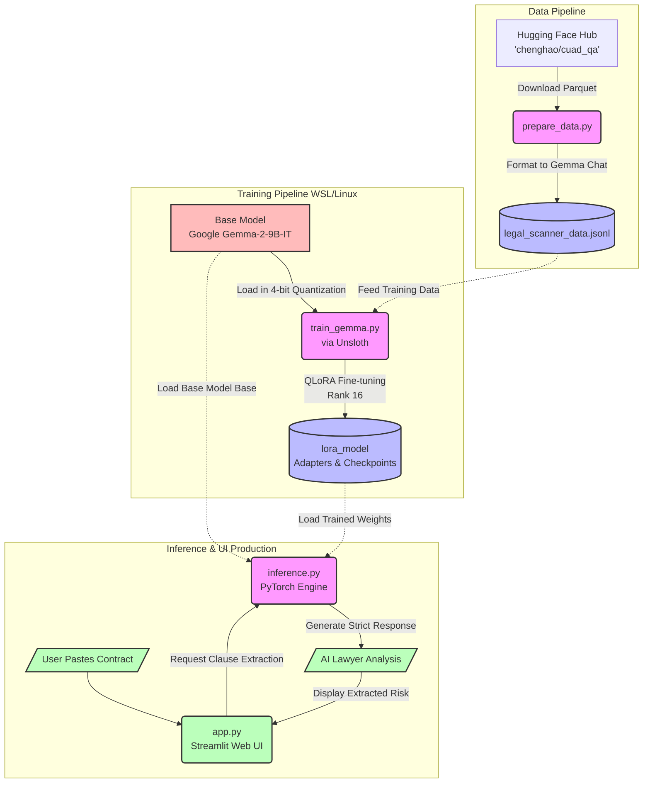

# Legal Scanner: End-to-End Process Flow

The diagram below illustrates the complete lifecycle of the Legal "Red Flag" Scanner, from fetching the raw dataset to presenting the final AI analysis to the user.

## System Architecture Diagram

## Step-by-Step Breakdown

1.  **Data Acquisition (`prepare_data.py`)**: 
    The script reaches out to Hugging Face and downloads the expert-annotated CUAD dataset. It automatically cleans and transforms the data into a `.jsonl` format specifically designed for Gemma's conversational training.

2.  **Model Fine-Tuning (`train_gemma.py`)**: 
    Using the Unsloth library in a Linux/WSL environment, the massive base Gemma model is shrunk down into 4-bit memory so it fits on your RTX 5050. The model is then trained on the `.jsonl` data, learning exactly how a lawyer extracts risky clauses.

3.  **Adapter Saving (`lora_model`)**: 
    Instead of saving a massive 18GB model, the system only saves the *differences* (the new knowledge) into a tiny LoRA adapter folder.

4.  **User Interaction (`app.py`)**: 
    A user opens the Streamlit web app, pastes in a new, unseen contract, and selects what they want to look for (e.g., "Termination clause").

5.  **Inference Execution (`inference.py`)**: 
    The engine quickly boots up the base model, snaps your trained LoRA adapter on top of it, and feeds the user's contract to the AI.

6.  **Results**: 
    The AI reads the contract, extracts the exact legal risk, and passes it back to the beautiful web interface for the user to read.
