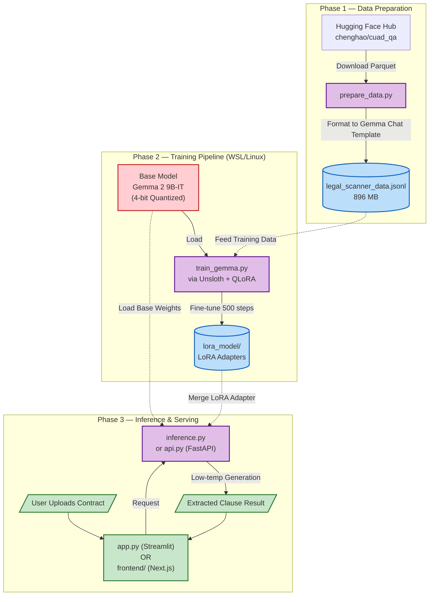
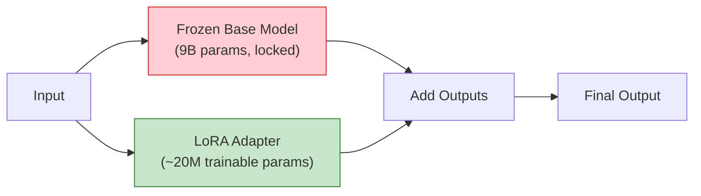
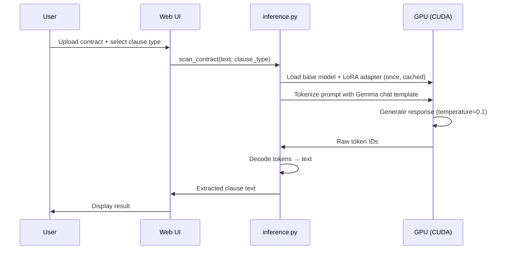

# Legal Red Flag Scanner — Complete Training & Technical Documentation

> **Project:** AI-Powered Legal Contract Clause Extraction Engine  
> **Base Model:** Google Gemma 2 9B-IT (Instruction-Tuned)  
> **Fine-Tuning Method:** QLoRA via Unsloth  
> **Hardware Target:** NVIDIA RTX 5050 (6–8 GB VRAM)  
> **Privacy Model:** 100 % Local / Offline — zero data leaves the machine

---

## Table of Contents

1. [Project Overview](#1-project-overview)  
2. [System Architecture](#2-system-architecture)  
3. [Data Source — CUAD Dataset](#3-data-source--cuad-dataset)  
4. [Data Preparation Pipeline](#4-data-preparation-pipeline)  
5. [Training Pipeline — Deep Dive](#5-training-pipeline--deep-dive)  
6. [Hyperparameter Reference](#6-hyperparameter-reference)  
7. [Training Execution](#7-training-execution)  
8. [Inference Engine](#8-inference-engine)  
9. [Web Interfaces](#9-web-interfaces)  
10. [Complete File Inventory](#10-complete-file-inventory)  
11. [Troubleshooting Guide](#11-troubleshooting-guide)  
12. [Future Roadmap](#12-future-roadmap)  

---

## 1. Project Overview

### 1.1 What It Does

The **Legal Red Flag Scanner** is a locally-running AI application that reads legal contracts (PDF, DOCX, TXT, or images) and extracts specific risk clauses on demand. It is purpose-built for freelancers, small businesses, and agencies who regularly sign vendor agreements, NDAs, and service contracts but cannot afford dedicated legal counsel for every document.

### 1.2 Why Build a Custom LLM?

| Concern | Cloud AI (ChatGPT, Claude) | This Project |
|---|---|---|
| **Data Privacy** | Contract text is sent to a third-party server | 100% local — nothing leaves your machine |
| **Cost** | Per-token API fees at scale | One-time training cost, then free forever |
| **Accuracy** | General-purpose, may hallucinate legal advice | Fine-tuned on real lawyer-annotated contracts |
| **Offline Use** | Requires internet | Works fully offline after setup |

### 1.3 Supported Clause Types

The scanner can extract **8 categories** of legal risk:

| # | Clause Type | What It Detects |
|---|---|---|
| 1 | **Termination** | How and when either party can cancel the agreement |
| 2 | **Non-compete** | Restrictions on future work or hiring practices |
| 3 | **Governing Law** | Which jurisdiction's laws control the contract |
| 4 | **Indemnification** | Where you absorb financial liability for others' mistakes |
| 5 | **Liability Cap** | Maximum amount you can be sued for |
| 6 | **Exclusivity** | Whether you're locked out from working with competitors |
| 7 | **Audit Rights** | Whether a client can inspect your books or systems |
| 8 | **Document Name** | The formal title/name of the agreement |

---

## 2. System Architecture

### 2.1 High-Level Architecture Diagram



### 2.2 Component Summary

| Component | File(s) | Purpose |
|---|---|---|
| Data Prep | `prepare_data.py` | Downloads CUAD, formats for Gemma |
| Training | `train_gemma.py` | QLoRA fine-tuning via Unsloth |
| Inference | `inference.py` | Loads model + adapter, runs generation |
| API Server | `api.py` | FastAPI REST endpoint for the Next.js frontend |
| Streamlit UI | `app.py` | Self-contained web UI (no separate backend needed) |
| Next.js UI | `frontend/` | Premium React-based web UI (requires `api.py`) |

---

## 3. Data Source — CUAD Dataset

### 3.1 Dataset Identity

| Property | Value |
|---|---|
| **Full Name** | Contract Understanding Atticus Dataset (CUAD) |
| **HuggingFace ID** | [`chenghao/cuad_qa`](https://huggingface.co/datasets/chenghao/cuad_qa) |
| **Original Source** | The Atticus Project — a collaboration between legal professionals and UC Berkeley researchers |
| **Paper** | [CUAD: An Expert-Annotated NLP Dataset for Legal Contract Review](https://arxiv.org/abs/2103.06268) (2021) |
| **License** | CC BY 4.0 |
| **Format Used** | Parquet (via HuggingFace `datasets` library) |

### 3.2 What CUAD Contains

CUAD is the gold-standard benchmark for legal contract understanding. It consists of:

- **510 real commercial contracts** sourced from the SEC's EDGAR system
- **13,000+ expert annotations** across 41 clause types
- Annotated by **law students from top US law schools** under the supervision of practicing attorneys
- Covers contracts like Distribution Agreements, NDAs, IP Licenses, Service Agreements, Employment Contracts, etc.

### 3.3 Original Dataset Schema (SQuAD-like QA)

Each row in the raw CUAD dataset follows the SQuAD 2.0 extractive QA format:

```json
{
  "context": "FULL TEXT OF THE CONTRACT (can be very long, 10-50 pages)...",
  "question": "Highlight the parts (if any) that discuss 'Governing Law'.",
  "answers": {
    "text": ["This Agreement shall be governed by the laws of the State of California..."],
    "answer_start": [45231]
  }
}
```

| Field | Description |
|---|---|
| `context` | The full text of the legal contract |
| `question` | A prompt asking about a specific clause type (41 possible types) |
| `answers.text` | The exact substring(s) from the contract that contain the clause |
| `answers.answer_start` | Character offset(s) where the answer begins in the context |

### 3.4 The 41 Clause Categories in CUAD

CUAD covers an extremely comprehensive set of legal risks:

| # | Category | # | Category |
|---|---|---|---|
| 1 | Document Name | 22 | Expiration Date |
| 2 | Parties | 23 | Renewal Term |
| 3 | Agreement Date | 24 | Notice Period to Terminate Renewal |
| 4 | Effective Date | 25 | Anti-Assignment |
| 5 | Termination for Convenience | 26 | Revenue/Profit Sharing |
| 6 | Rofr/Rofo/Rofn | 27 | Price Restrictions |
| 7 | Change of Control | 28 | Minimum Commitment |
| 8 | No-Solicit of Customers | 29 | Volume Restriction |
| 9 | Competitive Restriction Exception | 30 | IP Ownership Assignment |
| 10 | Non-Compete | 31 | Joint IP Ownership |
| 11 | Exclusivity | 32 | License Grant |
| 12 | No-Solicit of Employees | 33 | Non-Transferable License |
| 13 | Non-Disparagement | 34 | Affiliate License - Licensor |
| 14 | Termination for Convenience | 35 | Affiliate License - Licensee |
| 15 | Cap on Liability | 36 | Unlimited/All-You-Can-Eat License |
| 16 | Liquidated Damages | 37 | Irrevocable or Perpetual License |
| 17 | Insurance | 38 | Source Code Escrow |
| 18 | Covenant Not to Sue | 39 | Post-Termination Services |
| 19 | Third Party Beneficiary | 40 | Audit Rights |
| 20 | Governing Law | 41 | Uncapped Liability |
| 21 | Most Favored Nation | | |

> [!NOTE]
> Our scanner currently exposes 8 of these categories in the UI, but the model is trained on **all 41** — so it can handle any clause type if you modify the dropdown or API request.

### 3.5 Dataset Statistics (After Formatting)

| Metric | Value |
|---|---|
| **File** | `legal_scanner_data.jsonl` |
| **File Size** | 896 MB |
| **Format** | JSON Lines (one example per line) |
| **Total Training Examples** | ~22,000+ prompt-response pairs |
| **Average Context Length** | ~2,000–8,000 tokens per contract |
| **Positive Examples** | Contain extracted clause text |
| **Negative Examples** | Contain "No relevant clause found." |

---

## 4. Data Preparation Pipeline

### 4.1 Script: `prepare_data.py`

This script transforms the raw SQuAD-format CUAD into Gemma's conversational chat template.

### 4.2 Transformation Logic

**Input** (raw CUAD):
```json
{
  "context": "This Agreement shall be governed by...",
  "question": "Highlight the parts that discuss 'Governing Law'.",
  "answers": {"text": ["laws of the State of California"], "answer_start": [42]}
}
```

**Output** (Gemma chat format):
```json
{
  "text": "<start_of_turn>user\nYou are an expert corporate lawyer. Review the following contract text and extract any clauses related to: Highlight the parts that discuss 'Governing Law'.\n\nContract Text:\nThis Agreement shall be governed by...<end_of_turn>\n<start_of_turn>model\nlaws of the State of California<end_of_turn>"
}
```

### 4.3 Key Design Decisions

| Decision | Rationale |
|---|---|
| **Gemma chat template** (`<start_of_turn>user/model`) | Must exactly match the base model's expected format for instruction-following |
| **System prompt in user turn** | "You are an expert corporate lawyer..." primes the model's persona |
| **Extraction, not generation** | The model learns to *copy* text from the contract, not *invent* legal advice |
| **Negative examples included** | When no clause exists, answer is "No relevant clause found." — teaches the model to say "I don't know" |

### 4.4 Running Data Preparation

```bash
# In WSL with venv activated
cd /mnt/c/Users/majip/Downloads/xllm/legal_scanner_llm
source venv_wsl/bin/activate
python prepare_data.py
```

> [!IMPORTANT]
> **You do NOT need to run this again.** The 896 MB `legal_scanner_data.jsonl` file is already generated and present in the project directory.

---

## 5. Training Pipeline — Deep Dive

### 5.1 Why We Need Fine-Tuning

The base Gemma 2 9B model is a general-purpose language model. While it knows *about* law in general, it has never been explicitly trained to:
- Read a full contract and extract specific clause types
- Use the exact output format we need (extracted text or "No relevant clause found.")
- Behave like a specialized legal extraction tool rather than a chatbot

Fine-tuning teaches the model our specific task with real lawyer-annotated examples.

### 5.2 Base Model: Gemma 2 9B-IT

| Property | Value |
|---|---|
| **Model** | `unsloth/gemma-2-9b-it` |
| **Parameters** | 9 Billion |
| **Architecture** | Decoder-only Transformer |
| **Context Window** | 8,192 tokens (we use 2,048) |
| **Training** | Instruction-tuned by Google on diverse tasks |
| **Why This Model?** | Beats many 70B models in reasoning benchmarks while fitting on consumer GPUs |

### 5.3 Quantization: 4-bit (QLoRA)

Full Gemma 2 9B requires ~18 GB VRAM in FP16. Our RTX 5050 has only 6–8 GB.

**Solution: 4-bit Quantization via `bitsandbytes`**

```
FP32 (full)    → 36 GB  ❌ Way too large
FP16 (half)    → 18 GB  ❌ Still too large
INT8 (8-bit)   → 9 GB   ❌ Borderline
INT4 (4-bit)   → ~5 GB  ✅ Fits on RTX 5050!
```

Quantization compresses each model weight from 32 bits down to 4 bits with minimal quality loss. The `bitsandbytes` library handles this automatically during model loading.

### 5.4 LoRA (Low-Rank Adaptation)

Instead of updating all 9 billion parameters (impossible on consumer hardware), LoRA freezes the entire base model and injects small trainable matrices into specific layers.



#### LoRA Configuration

```python
model = FastLanguageModel.get_peft_model(
    model,
    r = 16,                    # Rank of the LoRA matrices
    target_modules = [         # Which layers get LoRA adapters
        "q_proj",  "k_proj",   # Query and Key attention projections
        "v_proj",  "o_proj",   # Value and Output attention projections
        "gate_proj",           # Feed-forward gate projection
        "up_proj",             # Feed-forward up projection
        "down_proj",           # Feed-forward down projection
    ],
    lora_alpha = 16,           # Scaling factor (alpha/r = effective lr scale)
    lora_dropout = 0,          # No dropout (Unsloth optimized)
    bias = "none",             # Don't train biases
    use_gradient_checkpointing = "unsloth",  # Memory optimization
    random_state = 3407,       # Reproducibility seed
)
```

| Parameter | Value | Explanation |
|---|---|---|
| **Rank (`r`)** | 16 | Dimensionality of the low-rank decomposition. Higher = more capacity but more memory. 16 is a sweet spot for most tasks. |
| **Target Modules** | 7 modules | All attention projections + feed-forward layers. This gives LoRA maximum influence over the model's behavior. |
| **Alpha** | 16 | Scaling factor. When `alpha == r`, the effective learning rate multiplier is 1.0. |
| **Dropout** | 0 | Unsloth's optimized implementation doesn't need dropout for regularization. |
| **Gradient Checkpointing** | `"unsloth"` | Trades compute for memory — recomputes activations during backward pass instead of storing them. The `"unsloth"` mode is 30% faster than standard checkpointing. |

#### What Gets Trained?

| Component | Parameters | Trainable? |
|---|---|---|
| Base Gemma 2 9B | ~9,000,000,000 | ❄️ **Frozen** |
| LoRA Adapters | ~20,000,000 | 🔥 **Trained** |
| **% of model trained** | **~0.2%** | |

This means the final saved adapter (`lora_model/`) is only **~80 MB** instead of 18 GB.

### 5.5 Unsloth Framework

[Unsloth](https://github.com/unslothai/unsloth) is a specialized fine-tuning framework that rewrites core PyTorch operations using Triton GPU kernels.

| Benefit | Description |
|---|---|
| **2× faster training** | Custom Triton kernels for attention, cross-entropy, and RoPE |
| **70% less memory** | Optimized gradient checkpointing and memory management |
| **No accuracy loss** | Mathematically equivalent to standard training |
| **Automatic 4-bit** | Seamlessly integrates with bitsandbytes quantization |

### 5.6 The SFTTrainer (Supervised Fine-Tuning)

We use HuggingFace TRL's `SFTTrainer` which is purpose-built for instruction-tuning LLMs on conversational datasets.

```python
trainer = SFTTrainer(
    model = model,
    tokenizer = tokenizer,
    train_dataset = dataset,
    dataset_text_field = "text",       # Column containing the formatted prompts
    max_seq_length = 2048,             # Max tokens per example
    dataset_num_proc = 2,              # Parallel data loading workers
    packing = False,                   # Don't pack multiple examples into one sequence
    args = TrainingArguments(...)       # See hyperparameter table below
)
```

---

## 6. Hyperparameter Reference

### 6.1 Training Arguments

| Hyperparameter | Value | What It Controls |
|---|---|---|
| `per_device_train_batch_size` | **2** | Number of examples processed per GPU per step. Limited by VRAM. |
| `gradient_accumulation_steps` | **4** | Accumulate gradients over 4 mini-batches before updating weights. Effective batch size = 2 × 4 = **8**. |
| `warmup_steps` | **10** | Number of steps with linearly increasing learning rate (prevents early instability). |
| `max_steps` | **500** | Total number of training steps. At effective batch size 8, this processes 4,000 examples. |
| `learning_rate` | **2e-4** | Peak learning rate. Standard for LoRA fine-tuning. |
| `fp16` / `bf16` | **Auto** | Uses BF16 if GPU supports it (better numerical stability), otherwise FP16. RTX 5050 supports BF16. |
| `logging_steps` | **10** | Print training loss every 10 steps (50 log entries total). |
| `optim` | **adamw_8bit** | 8-bit AdamW optimizer — uses 2× less memory than standard AdamW with negligible quality loss. |
| `weight_decay` | **0.01** | L2 regularization to prevent overfitting. |
| `lr_scheduler_type` | **linear** | Learning rate decays linearly from peak to 0 over the training run. |
| `seed` | **3407** | Random seed for reproducibility. |
| `output_dir` | **outputs/** | Directory for checkpoints and training logs. |
| `save_steps` | **100** | Save a checkpoint every 100 steps (5 checkpoints total). |

### 6.2 Effective Training Scale

| Metric | Calculation | Value |
|---|---|---|
| Effective Batch Size | `per_device_batch × grad_accum` | 2 × 4 = **8** |
| Total Examples Processed | `max_steps × effective_batch` | 500 × 8 = **4,000** |
| Checkpoints Saved | `max_steps / save_steps` | 500 / 100 = **5** |
| Log Entries | `max_steps / logging_steps` | 500 / 10 = **50** |

### 6.3 Memory Estimate (RTX 5050, 8 GB VRAM)

| Component | VRAM |
|---|---|
| Base model (4-bit) | ~5.0 GB |
| LoRA adapters | ~0.1 GB |
| Optimizer states (8-bit) | ~0.2 GB |
| Activations + gradients | ~1.5 GB |
| **Total Estimated** | **~6.8 GB** |

> [!WARNING]
> If you get **Out Of Memory (OOM)** errors, reduce `max_seq_length` from 2048 to **1024** in `train_gemma.py` (line 9). This halves activation memory.

---

## 7. Training Execution

### 7.1 Prerequisites Checklist

- [x] WSL 2 installed with Ubuntu
- [x] Python 3.14 with venv in WSL
- [x] All dependencies installed in `venv_wsl/`
- [x] NVIDIA GPU with CUDA available (`torch.cuda.is_available() == True`)
- [x] `legal_scanner_data.jsonl` present (896 MB)

### 7.2 How to Start Training

```bash
# Open WSL terminal
wsl

# Navigate to project
cd /mnt/c/Users/majip/Downloads/xllm/legal_scanner_llm

# Activate virtual environment
source venv_wsl/bin/activate

# Start training
python train_gemma.py
```

### 7.3 What Happens During Training

```
Step 1    → Model downloads from HuggingFace (~5 GB, first time only)
Step 2    → Model loads into GPU in 4-bit quantization
Step 3    → LoRA adapters are injected into 7 target modules
Step 4    → Dataset (896 MB) is loaded and tokenized
Step 5    → Training loop begins (500 steps)
              ├── Every 10 steps  → Loss is logged to console
              ├── Every 100 steps → Checkpoint saved to outputs/
              └── Step 500        → Training complete
Step 6    → Final LoRA adapter saved to lora_model/
```

### 7.4 Expected Console Output

```
Loading Gemma 2 9B model in 4-bit quantization...
🦥 Unsloth: Will patch your computer to enable 2x faster free finetuning.
Adding LoRA adapters...
Loading your custom legal scanner dataset...
Starting Training! This will take time based on your GPU...

{'loss': 2.4532, 'learning_rate': 0.0002, 'epoch': 0.0}    # Step 10
{'loss': 1.8921, 'learning_rate': 0.00019, 'epoch': 0.01}   # Step 20
{'loss': 1.3456, 'learning_rate': 0.00018, 'epoch': 0.02}   # Step 30
...
{'loss': 0.4123, 'learning_rate': 0.00002, 'epoch': 0.15}   # Step 490
{'loss': 0.3987, 'learning_rate': 0.0, 'epoch': 0.15}       # Step 500

Training Complete! Saving the final model...
Model saved to 'lora_model' directory. You are ready for inference!
```

### 7.5 Expected Training Duration

| GPU | Estimated Time |
|---|---|
| RTX 5050 (8 GB) | ~2–4 hours |
| RTX 4060 (8 GB) | ~1.5–3 hours |
| RTX 4090 (24 GB) | ~30–60 minutes |

### 7.6 Output Files

After training completes, the `lora_model/` directory will contain:

```
lora_model/
├── adapter_config.json       # LoRA configuration metadata
├── adapter_model.safetensors # The trained LoRA weights (~80 MB)
├── tokenizer.json            # Tokenizer vocabulary
├── tokenizer_config.json     # Tokenizer settings
├── special_tokens_map.json   # Special token mappings
└── README.md                 # Auto-generated model card
```

> [!TIP]
> The entire `lora_model/` folder is only ~80 MB. You can copy it, share it, or back it up easily. To use it on another machine, you just need the base Gemma 2 9B model + this folder.

---

## 8. Inference Engine

### 8.1 How Inference Works



### 8.2 Prompt Template (Must Match Training)

The inference prompt **must exactly match** the format used during training:

```
<start_of_turn>user
You are an expert corporate lawyer. Review the following contract text and extract any clauses related to: {clause_type}

Contract Text:
{contract_text}<end_of_turn>
<start_of_turn>model
```

The model then generates the extracted clause after `<start_of_turn>model\n`.

### 8.3 Generation Parameters

| Parameter | Value | Purpose |
|---|---|---|
| `max_new_tokens` | 256 | Maximum response length — keeps output concise |
| `temperature` | 0.1 | **Very low** — forces deterministic, faithful extraction. Prevents hallucination. |
| `use_cache` | True | Enables KV-cache for faster auto-regressive generation |

### 8.4 Inference Mode Optimization

```python
FastLanguageModel.for_inference(model)
```

This Unsloth call:
- Disables autograd (no gradient computation)
- Optimizes attention caching
- Reduces memory usage by ~50%
- Delivers **2× faster generation** vs standard PyTorch inference

---

## 9. Web Interfaces

### 9.1 Option A: Streamlit UI (`app.py`)

A self-contained web application that bundles the UI and inference engine in one process.

| Property | Value |
|---|---|
| **Command** | `streamlit run app.py` |
| **URL** | `http://localhost:8501` |
| **Backend** | Embedded (inference.py loaded via `@st.cache_resource`) |
| **File Upload** | PDF, DOCX, TXT, PNG, JPG |
| **Dependencies** | `pdfplumber`, `docx2txt`, `pytesseract`, `Pillow` |

### 9.2 Option B: Next.js Frontend (`frontend/`)

A premium React-based UI built with Next.js 16, connecting to a separate FastAPI backend.

| Property | Value |
|---|---|
| **Frontend Command** | `cd frontend && npm run dev` |
| **Frontend URL** | `http://localhost:3000` |
| **Backend Command** | `uvicorn api:app --reload --port 8000` |
| **Backend URL** | `http://localhost:8000` |
| **API Endpoint** | `POST /api/scan` (multipart form) |
| **Health Check** | `GET /api/health` |

#### API Request Format

```bash
# File upload
curl -X POST http://localhost:8000/api/scan \
  -F "file=@contract.pdf" \
  -F "clause_type=Termination clause"

# Text input
curl -X POST http://localhost:8000/api/scan \
  -F "contract_text=This Agreement shall be governed by..." \
  -F "clause_type=Governing Law"
```

#### API Response Format

```json
{
  "status": "success",
  "clause": "Governing Law",
  "result": "This Agreement shall be governed by the laws of the State of California.",
  "extracted_text": "This Agreement shall be governed by..."
}
```

---

## 10. Complete File Inventory

| File | Size | Purpose |
|---|---|---|
| [`prepare_data.py`](file:///c:/Users/majip/Downloads/xllm/legal_scanner_llm/prepare_data.py) | 1.4 KB | Downloads CUAD from HuggingFace, formats to Gemma chat template |
| [`legal_scanner_data.jsonl`](file:///c:/Users/majip/Downloads/xllm/legal_scanner_llm/legal_scanner_data.jsonl) | 896 MB | The formatted training dataset (already generated) |
| [`train_gemma.py`](file:///c:/Users/majip/Downloads/xllm/legal_scanner_llm/train_gemma.py) | 2.6 KB | Main training script — loads model, configures LoRA, trains, saves adapter |
| [`inference.py`](file:///c:/Users/majip/Downloads/xllm/legal_scanner_llm/inference.py) | 2.6 KB | `LegalScannerEngine` class — loads model + adapter, generates responses |
| [`app.py`](file:///c:/Users/majip/Downloads/xllm/legal_scanner_llm/app.py) | 4.0 KB | Streamlit web UI (self-contained with embedded inference) |
| [`api.py`](file:///c:/Users/majip/Downloads/xllm/legal_scanner_llm/api.py) | 3.2 KB | FastAPI REST server (backend for Next.js frontend) |
| [`frontend/app/page.tsx`](file:///c:/Users/majip/Downloads/xllm/legal_scanner_llm/frontend/app/page.tsx) | 8.8 KB | Next.js React frontend page |
| [`requirements.txt`](file:///c:/Users/majip/Downloads/xllm/legal_scanner_llm/requirements.txt) | 158 B | Python dependency list |
| [`install_all.sh`](file:///c:/Users/majip/Downloads/xllm/legal_scanner_llm/install_all.sh) | — | Full WSL dependency installation script |
| [`install_remaining.sh`](file:///c:/Users/majip/Downloads/xllm/legal_scanner_llm/install_remaining.sh) | — | Supplementary install script (app deps + verification) |
| [`ARCHITECTURE.md`](file:///c:/Users/majip/Downloads/xllm/legal_scanner_llm/ARCHITECTURE.md) | 3.0 KB | Technical architecture overview |
| [`FEATURES.md`](file:///c:/Users/majip/Downloads/xllm/legal_scanner_llm/FEATURES.md) | 2.2 KB | Feature descriptions and capabilities |
| [`PROCESS_FLOW.md`](file:///c:/Users/majip/Downloads/xllm/legal_scanner_llm/PROCESS_FLOW.md) | 2.7 KB | End-to-end process flow with Mermaid diagram |
| [`SETUP.md`](file:///c:/Users/majip/Downloads/xllm/legal_scanner_llm/SETUP.md) | 2.9 KB | Step-by-step setup guide |
| [`README.md`](file:///c:/Users/majip/Downloads/xllm/legal_scanner_llm/README.md) | 1.9 KB | Project README with quick-start instructions |

---

## 11. Troubleshooting Guide

### 11.1 Out Of Memory (OOM) During Training

**Symptom:** `CUDA out of memory` error during training.

**Fix:** Reduce sequence length in `train_gemma.py` line 9:
```python
max_seq_length = 1024  # Was 2048
```
Or reduce batch size on line 50:
```python
per_device_train_batch_size = 1  # Was 2
```

### 11.2 Training Loss Not Decreasing

**Symptom:** Loss stays flat at ~2.5 after 100+ steps.

**Possible Causes:**
- Learning rate too low → Try `5e-4`
- LoRA rank too low → Try `r = 32`
- Data quality issue → Verify `legal_scanner_data.jsonl` format

### 11.3 Model Outputs Garbage Text

**Symptom:** Inference returns nonsensical or truncated text.

**Fix:** Ensure the inference prompt template in `inference.py` **exactly** matches the training template in `prepare_data.py`. Even a single character difference breaks the model's learned pattern.

### 11.4 `torch.cuda.is_available()` Returns False

**Symptom:** GPU not detected in WSL.

**Fix:**
1. Ensure NVIDIA GPU drivers are installed **on Windows** (not inside WSL)
2. Run `nvidia-smi` inside WSL to verify GPU visibility
3. Ensure you're using WSL **2** (not WSL 1): `wsl --list --verbose`

### 11.5 Pillow Build Fails

**Symptom:** `RequiredDependencyException: jpeg` during `pip install`.

**Fix:** Install system libraries in WSL:
```bash
sudo apt install -y libjpeg-dev zlib1g-dev libfreetype-dev python3-dev build-essential
```

---

## 12. Future Roadmap

### 12.1 Short-Term Improvements

| Improvement | Effort | Impact |
|---|---|---|
| Increase `max_steps` to 2000+ | Low | Better accuracy with more training |
| Add validation split | Low | Monitor overfitting during training |
| Expose all 41 CUAD clause types in UI | Low | Full coverage of legal risks |
| Add batch document processing | Medium | Scan multiple contracts at once |

### 12.2 Medium-Term Enhancements

| Enhancement | Description |
|---|---|
| **RAG (Retrieval-Augmented Generation)** | Chunk long contracts and retrieve relevant sections before inference, enabling unlimited document length |
| **Multi-clause scan** | Extract all risk clauses in a single pass instead of one-at-a-time |
| **Confidence scoring** | Output a confidence score alongside each extraction |
| **Custom clause training** | Allow users to add their own example clauses and retrain |

### 12.3 Long-Term Vision

| Goal | Description |
|---|---|
| **Red/Yellow/Green risk scoring** | Automatically classify extracted clauses as high/medium/low risk |
| **Contract comparison** | Compare two contract versions side-by-side |
| **Multi-language support** | Fine-tune on legal contracts in other languages |
| **GGUF export** | Convert to GGUF format for use with llama.cpp (pure CPU inference, no GPU needed) |

---

> **Document Version:** 1.0  
> **Last Updated:** May 21, 2026  
> **Author:** Generated for the Legal Scanner LLM Project
